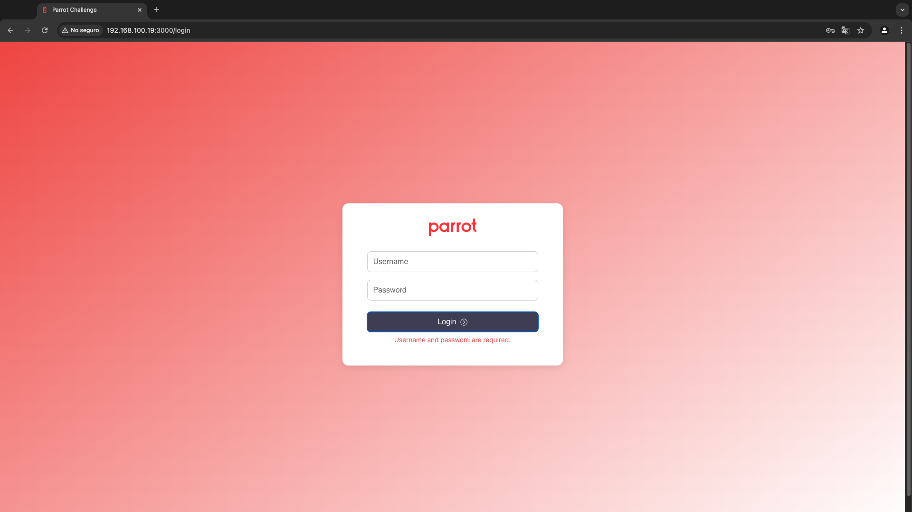
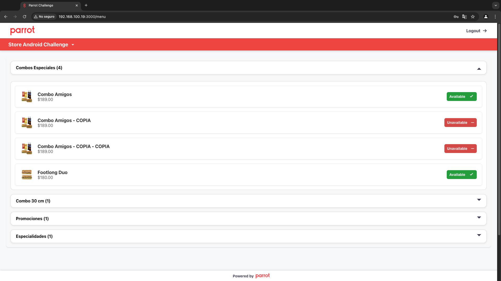

# Parrot Frontend Coding Challenge

## Project Overview

The **Parrot Frontend Coding Challenge** is a web application designed to manage user authentication and provide an intuitive interface for editing menus, including categories and products. The project emphasizes clean code principles, scalability, and best practices, ensuring maintainability and extensibility.

### Key Features

1. **User Authentication**:
   - Login with secure token-based authentication.
   - Tokens are managed using cookies, with HttpOnly and secure flags enabled for enhanced security.
   - Automatic token refresh for seamless user experience.

2. **Menu Management**:
   - View and manage categories and products interactively.
   - Toggle product availability in real-time with visual feedback.

3. **Enhanced Security**:
   - Cookies are encrypted to prevent unauthorized access to sensitive data.
   - Secure token lifecycle management, including expiration and refresh mechanisms.

4. **Dynamic Rendering**:
   - Handles both static and server-rendered deployments using Node.js.

5. **Centralized Labels for Text Management**:
   - The project uses a centralized `labels` utility for managing all user-facing text.
   - This ensures consistent text formatting and easy future localization.

### Screenshots

#### Login Page
The login page provides user authentication with feedback for errors or ongoing operations.



#### Menu Page
The menu page displays categories and products, with the ability to toggle product availability.



## Getting Started

### Prerequisites

Ensure the following are installed on your system:

- Node.js (v14+)
- npm (v6+)

### Installation

1. Clone the repository:

```bash
git clone https://github.com/wmendozaj/parrot-challenge.git
```

2. Navigate to the project directory:

```bash
cd parrot-challenge
```

3. Install dependencies:

```bash
npm install
```

### Running the Project

### Development Server

Start the development server locally:

```bash
npm start
```

The application will run on [http://localhost:3000](http://localhost:3000).

### Testing

Run the test suite to validate the application:

```bash
npm test
```

## Deployment Instructions

The project supports **static** and **server-based** deployments. Follow the steps below based on your preference:

### Static Deployment

1. Build the project:

```bash
npm run build
```

2. Deploy the contents of the `build` folder to a static hosting service.

### Server Deployment

1. Install Express:

```bash
npm install express
```

2. Build the project:

```bash
npm run build
```

3. Start the server:

```bash
node server.js
```

## Technologies Used

- **React** with **TypeScript**: For building the component-based user interface.
- **Redux Toolkit**: For robust and scalable state management.
- **Axios**: To handle API requests and HTTP interactions.
- **Styled-Components**: For modular and dynamic styling.
- **Jest**: For unit and integration testing of components and services.
- **Express.js**: To enable server-side rendering and API proxy support in server-based deployments.

## Postman Setup

To test the API endpoints:

1. Import the API collection: [API Collection](https://pastebin.com/PTzm1Pud).
2. Import the environment variables: [Environment Variables](https://bit.ly/3jEuKVR).
3. Set up and include the authentication token in Postman to successfully authenticate API requests.

## Folder Structure

The project adheres to a clean and modular folder structure, ensuring scalability and maintainability:

```bash
/project-root
├── /build              # Build folder for deployment
├── /public             # Public assets
├── /src
│   ├── /components     # Reusable UI components
│   ├── /pages          # Application pages
│   ├── /redux          # State management slices and store
│   ├── /services       # API interaction logic
│   ├── /hooks          # Custom React hooks
│   ├── /utils          # Utility functions (e.g., labels, cookies)
│   ├── /styles         # Shared styles
│   ├── /assets         # Images and static files
│   ├── App.tsx         # Root component
│   └── index.tsx       # Entry point
├── server.js           # Express server for server deployment
└── README.md           # Project documentation
```

## License

This project is licensed under the MIT License.
